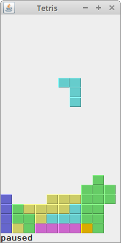

# Java-Tetris-Game

The Tetris Game is a Java-based implementation of the iconic tile-matching puzzle game. Players rotate and position falling tetrominoes to create complete lines, which then disappear. The objective is to clear as many lines as possible before the screen fills up.

## Table of Contents

- [Features](#features)
- [Technologies Used](#technologies-used)
- [Source Code](#source-code)

## Features

- **Classic Gameplay**: Rotate and position falling tetrominoes to create complete lines.
- **Score Tracking**: Keeps track of the player's score.
- **Increasing Difficulty**: Tetrominoes fall faster as the game progresses.
- **Game Over Detection**: Ends the game when the screen fills up.

## Technologies Used

- **Java**: Core programming language used for the project.

## Source Code

- `https://zetcode.com/javagames/tetris/`

------
